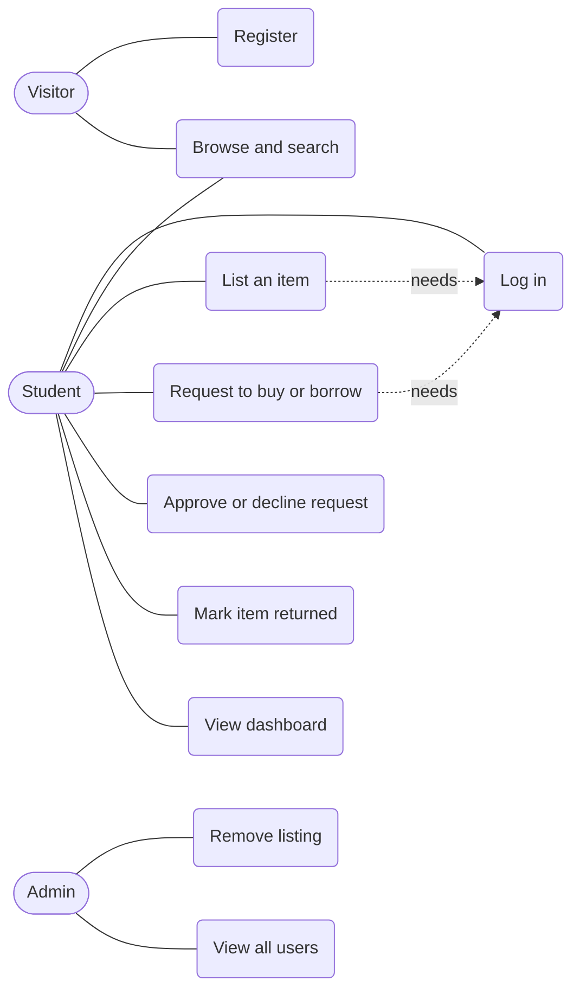
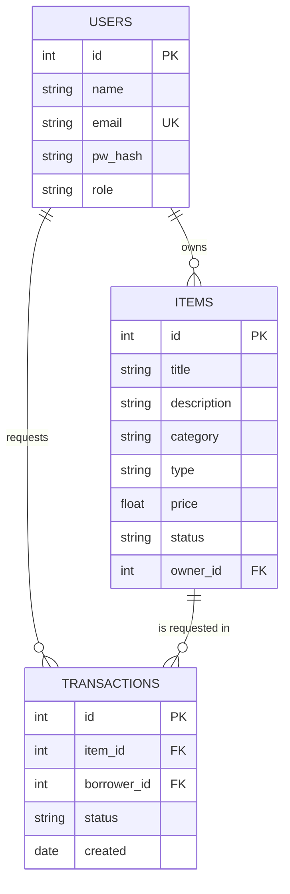
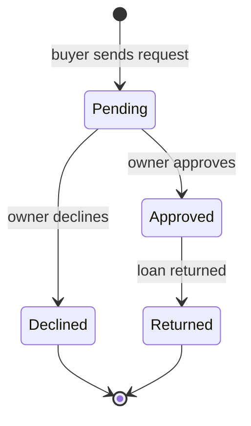

# CampusSwap: Software Requirements Specification and Design

## 1. Introduction
**Purpose.** CampusSwap is a web site where students on a campus buy, sell, lend and borrow study materials such as textbooks, calculators and lab equipment.

**Scope.** In scope: accounts, item listings, search, request and approval flow, user dashboard, basic admin. Out of scope: online payments, delivery, chat, mobile apps, ratings.

| Role | Description |
|---|---|
| Student (owner) | Lists items to sell or lend and answers requests |
| Student (borrower or buyer) | Searches items and sends requests. Any student can be both |
| Admin | Views users and listings and removes inappropriate listings |

## 2. Functional requirements
| ID | Requirement |
|---|---|
| FR1 | A visitor can register with a name, a campus email ending in .edu and a password of 6 or more characters |
| FR2 | A registered user can log in and log out |
| FR3 | A logged-in user can create a listing with title, description, category, type (sell or lend) and price |
| FR4 | An owner can edit or delete their own listings |
| FR5 | Anyone can browse listings and search by keyword, category and type |
| FR6 | A logged-in user can request to buy or borrow an available item that is not their own |
| FR7 | The owner can approve or decline a pending request. Approving one request declines the other pending ones |
| FR8 | The owner can mark an approved loan as returned, which makes the item available again |
| FR9 | A dashboard shows a user's listings, requests received and requests sent |
| FR10 | An admin can view all users and listings and remove any listing |

## 3. Non-functional requirements
| ID | Requirement |
|---|---|
| NFR1 Security | Passwords are stored as hashes. Only owners can change their listings and requests |
| NFR2 Usability | Pages work on phones and desktops. A new user can list an item in under 2 minutes |
| NFR3 Performance | Search results appear within 2 seconds for up to 1,000 listings |
| NFR4 Maintainability | Code is in Git, has automated tests and a README with run steps |
| NFR5 Portability | Runs on any machine with Python 3 and a modern browser |

## 4. Use case diagram

## 5. Entity-relationship diagram

## 6. Request status flow

Item status: Available, then Borrowed or Sold when a request is approved. A returned loan makes the item Available again.

## 7. Architecture and test plan
A browser front end (HTML, CSS, JavaScript) calls a Flask REST API, which reads and writes a SQLite database. Source code is kept in a Git repository.

| Test | Steps | Expected result |
|---|---|---|
| T1 Register | Sign up with a gmail address | Rejected with a message about .edu |
| T2 List and request | User A lists a calculator. User B requests it | Request shows as Pending for both |
| T3 Approve | A approves the request | Item shows Borrowed |
| T4 Permission | B tries to approve their own request | Blocked (403) |
| T5 Return | A marks the loan returned | Item shows Available |

T1 to T5 are covered by `test_app.py`.
